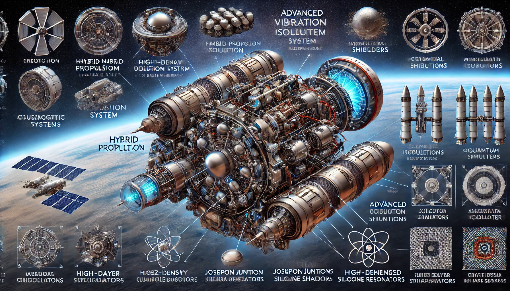
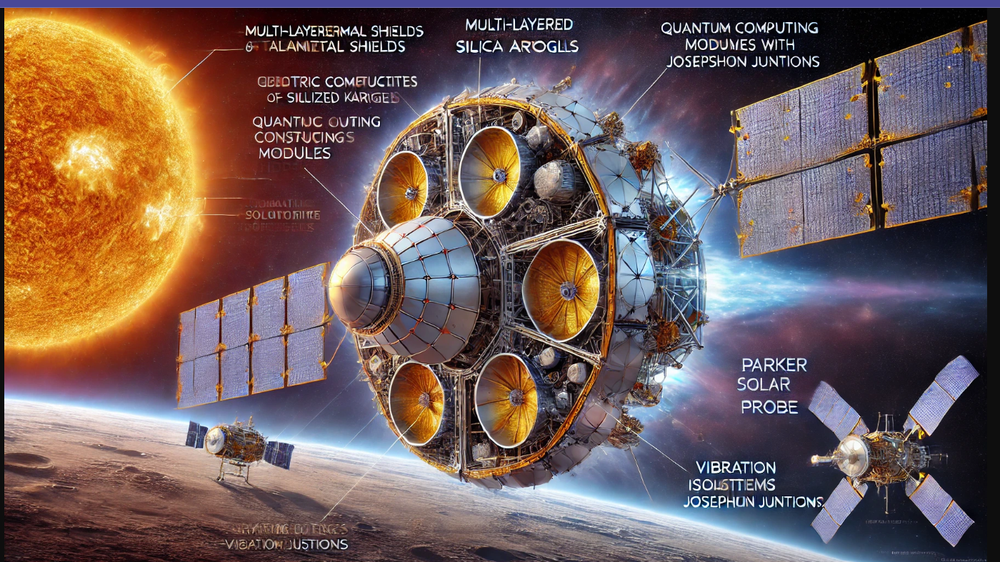

# Hybrid Propulsion System with Integrated Quantum Computing and Advanced Thermal-Vibration Shielding

## Introduction
This repository presents the design of a hybrid propulsion system integrating advanced quantum computing with effective thermal and vibration shielding. The system aims to ensure the functionality of superconducting and semiconducting qubits in hostile environments.

---

## Thermal and Vibration Shields for Qubits in Hostile Environments

### Detailed Diagram of the Hybrid Propulsion System
Below is a highly detailed technical diagram showcasing the hybrid propulsion system, including:

- Josephson Junctions
- Resonant Cavities
- Electric Motor with integrated quantum components
- Advanced thermal and vibration shielding layers



### Alternative Diagram with Focus on Quantum Components
A more specific design focused on Josephson Junctions, resonant cavities, and quantum signal processing in a modular layout.



---

## Features
1. **Thermal Shielding:** Multi-layer system with Kapton aluminized outer layers and aerogels for thermal insulation.
2. **Vibration Isolation:** Active and passive isolation systems using piezoelectric actuators and reinforced silicone dampers.
3. **Quantum Integration:** CPW star resonators and Josephson Junctions for precise quantum computations.
4. **Radiation Shielding:** Kevlar and high-density polyethylene for protection against cosmic radiation.
5. **Propulsion System:** Hybrid motor combining electric and chemical propulsion technologies.

---

## Applications
- Space missions requiring precision quantum computations.
- Hybrid propulsion for interplanetary travel.
- Advanced sensor integration for space exploration.

---
## Important design-concepts links

- **Resonator Design Example**: [Enlace a la página de Qiskit Metal](https://qiskit-community.github.io/qiskit-metal/circuit-examples/B.Resonators/11-Resonator_Meander.html)
- **Electric Motor Simulation and Design Guide**: [Enlace al artículo de SimScale](https://www.simscale.com/blog/electric-motor-simulation-and-design/)
- **Sensors**: [RLS Linear Sensors](https://www.rls.si/eng/linear?msclkid=9ba32184f91f1cd90b5946164d378733&utm_source=bing&utm_medium=cpc&utm_campaign=Europe%20%20-%20Linear%20encoders&utm_term=linear%20sensors&utm_content=Linear%20sensors)


## How to Use
1. Clone the repository:  
   ```bash
   git clone https://github.com/yourusername/Hybrid-Propulsion-System.git

### Requirements
To work with this project, you may need to install **Qiskit Metal** if you're interested in designing quantum components like resonators or other devices. This can be used in combination with the design of electric motors for rockets, offering a unique perspective on integrating quantum designs with propulsion systems.

To install Qiskit Metal, you can use the following command:

```bash
pip install qiskit-metal


